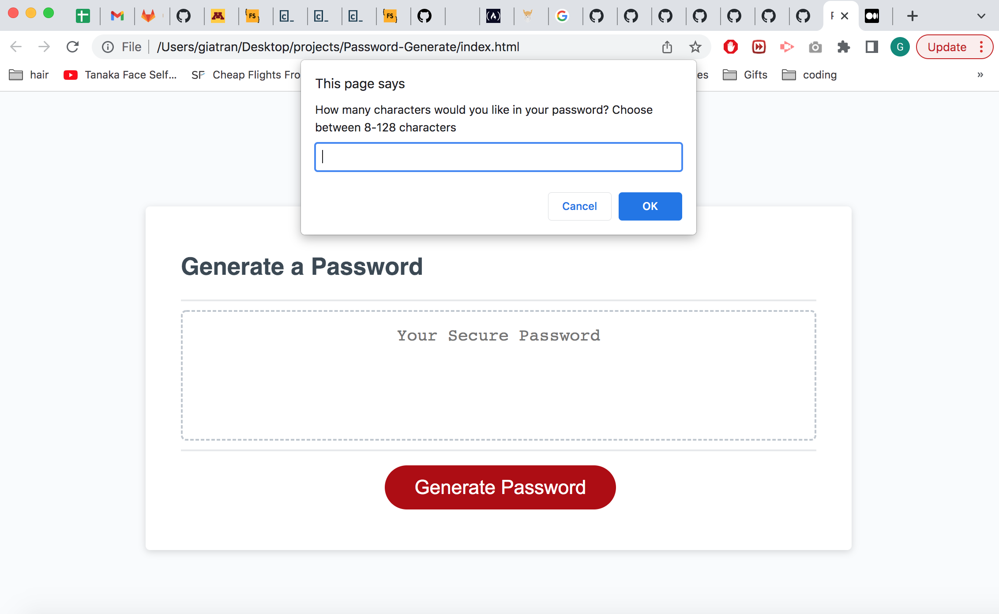

# Password-Generate

For this project, I was able to put my javascript skills to use and see if I understood what I learned.

During the extra tutoring sessions, I learned psuedo coding and how to use it to break down assignments and plan out my codes. Having the pseudo codes allowed me to see which part of the assignments I understood and which part I would need extra help on.

Going through the pseudo code, I was able to pinpoint a couple sections I could work on first.
* Creating arrays for the characters variables
* Confirms and Prompt for the password criteria
* Part of a For Loop

I created the arrays for the variables and an empty array which would hold the selected characters. Then I worked on coding if statements for the prompts asking about password length and the four password criterias. Lastly I worked on the partial For Loop: `for (var i = 0; i < passwordLength; i++) {[Math.floor(Math.random() * selectedCharacters.length)`. I knew there were variables in there I needed but it took me awhile to work out what I needed. After awhile I realized, I needed a variable for the final password, allowing me to finish the For Loop.

What I struggled with was not understanding why I kept generating underfined as a value. I kept looking at the codes over and over to see where I messed up in my code or if I was missing codes. After three hours, I went through the codes slowly from top to bottom, and I spotted my error. The section which allows me to concat my characters, all my codes were the following:
`if(uppercaseLetters){
    selectedCharacters.concat(uppercase)
}`

I forgot to add my selected characters variable to equal the concat portion which would look like:
`if(uppercaseLetters){
    selectedCharacters = selectedCharacters.concat(uppercase)`

Once I overcame this issue, my codes finally ran correctly, and I was excited it was generating a password.

## Usage
The window prompts the user how many characters they would like between 8-128 characters. Then the window goes through four confirmations asking if the user would like to include uppercase letters, lowercase letters, numeric characters or special characters.

## Deployed Site
https://gt1222.github.io/Password-Generate/